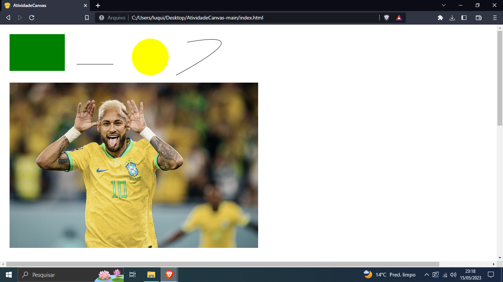

# DESCRIÇÃO
Leonardo e Lucas Noel

# HTML
Fizemos a estrtura inicial colocamos o icone e adicionamos o Canvas e definimos seus pixeis.

# JavaScript
Criamos uma variável onde capturamos o elemento id "canvas". Depois, criamos outra variável que recebe o elemento "ctx" em um contexto 2D.
## Retângulo
Em seguida, desenhamos um retângulo verde e definimos sua posição e tamanho.
## Círculo
Para o círculo, apenas definimos sua cor, posição e tamanho, e o preenchemos usando "fill".
## Linha
Para a linha, definimos seus pontos inicial e final, juntamente com a posição na tela, e usamos "stroke" para desenhar a linha entre os pontos inicial e final.
## Curva
Para a curva, fizemos algo semelhante à linha, adicionando um ponto inicial e final, juntamente com a linha que ficará, mas adicionamos uma curva.
## Imagem
Para a imagem, iniciamos sua instância, carregamos a imagem, definimos sua posição e tamanho, e, em seguida, linkamos a imagem que estava na pasta "img".

